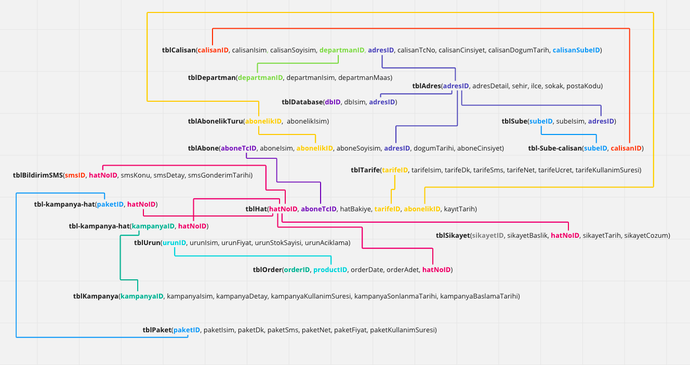
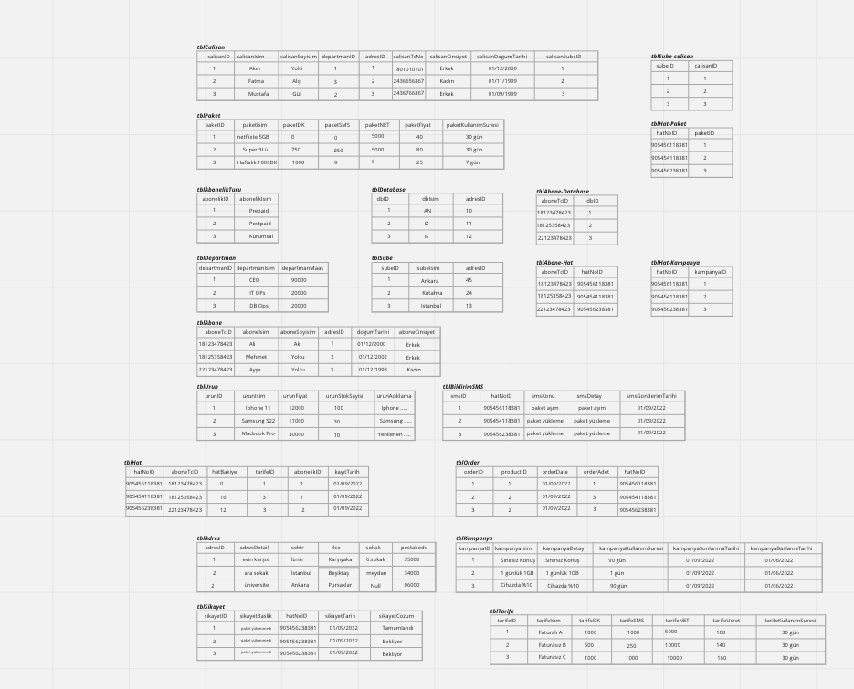
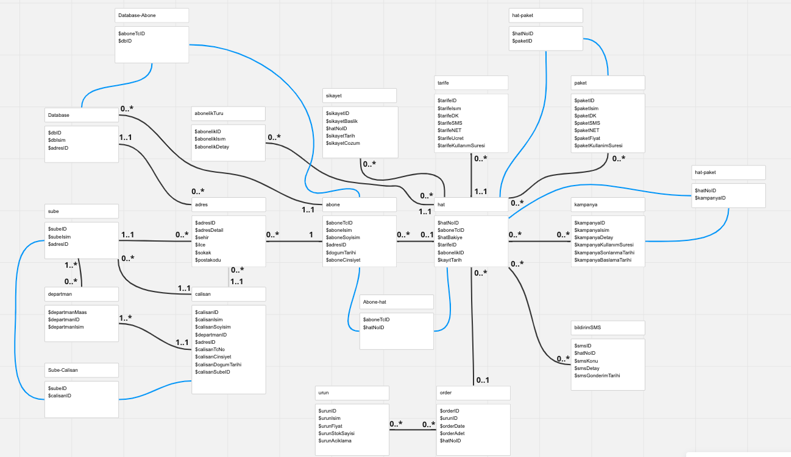

<h1 align="center">Telecommunication Sector Example Database System</h1>

<!-- TABLE OF CONTENTS -->
<h2 id="table-of-contents"> :book: Table Of Contents</h2>

<details open="open">
  <summary>Table Of Contents</summary>
  <ol>
    <li><a href="#bs-need"> ➤ Business Need </a></li>
    <li><a href="#bs-r"> ➤ Business Requirements </a></li>
    <li>
      <a href="#bs-v"> ➤ Business Value</a>
      <ul>
        <li><a href="#bs-rl">Business Rules</a></li>
        <li><a href="#cs-d">Class Diagram</a></li>
        <li><a href="#ex-d">Example Data</a></li>
        <li><a href="#l-d">Logical Diagram</a></li>
        <li><a href="#tt">10 Important SQL Operations</a></li>
      </ul>
    
  </ol>
</details>


<h2 id="bs-need"> :pencil: Business Need</h2>

<p align="justify"> 
Telecommunications is an industry that serves a wide range of people worldwide. Communication is an essential need for human beings. People mostly communicate via the internet, SMS, and call lately. Even a single break in communication can affect the lives of millions of people and deprive them of the agenda. Therefore, there is a need for a database that will understand people's needs correctly, keep their data securely, and simultaneously process this data regularly and make it easier to use.
</p>


<h2 id="bs-r"> :fork_and_knife: Business Requirements</h2>


* Subscribers can file a complaint about the product and package.
* Subscribers can be informed about the relevant product and package via SMS.
* For the subscriber to benefit from the services in the fastest way, the subscription registration will be made in the database closest to his/her location.
* There will be databases that branches across the country can connect to.
* Complaint records will be made on the line purchased by the subscriber, not on the subscriber.
* The subscriber can receive a phone call from the relevant operator through his number, and products can be purchased.


<!-- Yol Haritası -->
<h2 id="bs-v"> :dart: Business Value</h2>

<br>
<p>Of course, a system needs a workforce to ensure continuity. We can establish a system that will facilitate people's communication. however, labor and technical programs are needed for the sustainability of this system. In order to provide these, of course, we have to generate income from the people who use the system that we describe as subscribers. Communication is also built to make money, people do it every day, and so do companies. However, our system will not only save money but also cost the company more, so people who use our services will be charged less. In this way, they will be able to buy quality service for cheap and continue to communicate without interruption.
 </p>

  

  
  
<h3 id="bs-rl"> Business Rules <h3/> 
  
<h4> branch-employee:</h4>

* A branch can have 0 or more employees.
* an employee can work in at least 1 and at most 1 branch.

<h4> line-subscription type:</h4>

* a line can have at least 1 and at most 1 subscription type.
* a subscription type can have at least 0 1 or more than 1 error.

<h4>line-tariff:</h4>

* A subscriber can have at least 1 and at most 1 tariff.
* A tariff can have at least 0, 1 or more than 1 line.

<h4>subscribe-line:</h4>

* A subscriber can have at least 1 and more than 1 line.
* A line can have at least 1 and at most 1 subscriber.

<h4>line-product:</h4>

* A line can buy at least 0 and more than 1 product.
* A product can be purchased by at least 0 or more than 1 line.

<h4>line-campaign:</h4>

* A line can have at least 0 or more than 1 campaign.
* A campaign can have at least one or more than 1 line.

<h4>line - database:</h4>

* A minimum 1 maximum 1 database can exist.
* A database can hold more than one line.

<h4>line-complaint:</h4>

* A line can request at least 0, at most 1 or more than 1 complaint.
* A complaint request can be opened by at least 0, maximum 1 or more than 1 person.

<h4>subscriber-address:</h4>

* A subscriber can have at least 1 and at most 1 address.
* An address can have 1 or more than 1 subscriber.

<h4>employee-department:</h4>

* An employee can work in at least 1 and at most 1 department.
* A department can have 0 or more than 1 employee.

<h4>line-notificationsms:</h4>

* A line can receive at least 0 and more than 1 sms
* At least 0, 1 or more than 1 error can be sent in one sms.

<h4>line-package:</h4>

* A line can have at least 0 or more than 1 packets.
* A package can have at least one or more than 1 line.


<h3 id="cs-d"> Class Diagram :<h3/> 
  

<p align="center">
  
</p> 

  
  


  
<h3 id="ex-d"> Example Data :<h3/> 
  
  <p align="center">
  
</p> 
  
 

  
<h3 id="l-d"> Logical Diagram :<h3/>
  
 <p align="center">
  
</p>
  


<h3 id="tt"> 10 Important SQL Operations :<h3/>


 ```sh
    -- create a table of hat
CREATE TABLE tbl_hat (
  hatNoID bigint PRIMARY KEY,
  hatBakiye int,
  kayitTarihi date,
  tarifeID int,
  aboneTcID bigint,
  abonelikID int,
  FOREIGN KEY (tarifeID) REFERENCES tbl_tarife(tarifeID),
  FOREIGN KEY (aboneTcID) REFERENCES tbl_abone(aboneTcID),
  FOREIGN KEY (abonelikID) REFERENCES tbl_abonelik(abonelikID)
);

 ```
  
  
 ```sh
    -- insert some values into tbl_abonelik table
INSERT INTO tbl_abonelik values (1,"prepaid","anlık ucretlendirilen");
INSERT INTO tbl_abonelik values (2,"postpaid","aylık ucretlendirilen");

 ```

 ```sh
   -- alter tbl_hat table to add abonelikID column
ALTER TABLE tbl_smsBildirim
ADD smsDetay longtext;

 ```

 ```sh
   -- alter drop
ALTER TABLE tbl_smsBildirim
DROP column smsBaslik;

 ```

 ```sh
   -- update a value
UPDATE tbl_abone set aboneCinsiyet="K" where aboneTcID=55001323406;

 ```

 ```sh
   -- insert some values to tbl_hat table
INSERT INTO tbl_hat values (5456118381,0,"2015-11-20",0,18001363406,1);
INSERT INTO tbl_hat values (5425613775,0,"2022-11-20",0,55001323406,1);
INSERT INTO tbl_hat values (5523831863,0,"2022-11-20",1,55001323406,2);

 ```

 ```sh
   
-- trigger
CREATE TRIGGER print_tbl_abone
AFTER INSERT ON tbl_abone
FOR EACH ROW
BEGIN
    SELECT * FROM tbl_abone;
END;


-- procedure 

CREATE PROCEDURE insert_paket_hat(IN hatNo INT, IN paketId INT)
BEGIN
  INSERT INTO tbl_paket_hat (hatNoID, paketID) VALUES (hatNo, paketId);
  SELECT * FROM tbl_paket_hat WHERE hatNoID = hatNo;
END;


 ```

 ```sh
   
-- tbl_paket_hat tablosundaki ilişkileri kullanarak, tbl_paket tablosundaki paket 
-- isim bilgisini ve tbl_hat tablosundaki hat numarası bilgisini getirmek için:
SELECT tbl_paket.paketIsim, tbl_hat.hatNoID FROM tbl_paket
inner JOIN tbl_paket_hat ON tbl_paket.paketID = tbl_paket_hat.paketID
inner JOIN tbl_hat ON tbl_paket_hat.hatNoID = tbl_hat.hatNoID;


 ```

 ```sh
   
-- tbl_hat tablosundaki hat bilgileri ile birlikte, ilişkili olduğu tbl_abone tablosundaki abone isim 
-- bilgisini ve tbl_tarife tablosundaki tarife bilgilerini getirmek için:
SELECT tbl_hat.hatNoID, tbl_hat.hatBakiye, tbl_abone.aboneIsim, tbl_tarife.tarifeIsim FROM tbl_hat
inner JOIN tbl_abone ON tbl_hat.aboneTcID = tbl_abone.aboneTcID
inner JOIN tbl_tarife ON tbl_hat.tarifeID = tbl_tarife.tarifeID;


 ```

 ```sh
   
-- tbl_abone tablosundaki abone adı ve soyadı gibi bilgileri ile birlikte, ilişkili 
-- olduğu tbl_adres tablosundaki sehir bilgisini getirmek için:
SELECT tbl_abone.aboneIsim, tbl_abone.aboneSoyIsim, tbl_adres.sehir FROM tbl_abone
inner JOIN tbl_adres ON tbl_abone.adresID = tbl_adres.adresID;


 ```

 ```sh

-- tbl_abone, tbl_tarife, tbl_abonelik ve tbl_hat tablolarını kullanarak,
-- abonelerin isim, soyisim, doğum tarihi,
-- cinsiyet, tarife ismi, abonelik ismi, hat numarası ve hat bakiyesini getirir:
SELECT tbl_abone.aboneIsim, tbl_abone.aboneSoyIsim, tbl_abone.aboneDogumTarihi, tbl_abone.aboneCinsiyet,
tbl_tarife.tarifeIsim, tbl_abonelik.abonelikIsim, tbl_hat.hatNoID, tbl_hat.hatBakiye
FROM tbl_abone
inner JOIN tbl_hat ON tbl_abone.aboneTcID = tbl_hat.aboneTcID
inner JOIN tbl_tarife ON tbl_hat.tarifeID = tbl_tarife.tarifeID
inner JOIN tbl_abonelik ON tbl_hat.abonelikID = tbl_abonelik.abonelikID;

 ```

 ```sh

-- Bu sorgu, abone bilgilerini, hat bilgilerini, tarife bilgilerini ve abonelik bilgilerini
-- birleştirerek oluşan bilgileri vw_abone_bilgi adında bir VIEW oluşturur. Bu VIEW'ı kullanarak,
-- sadece tek bir sorgu ile bu bilgilere ulaşabilirsiniz.
CREATE VIEW vw_abone_bilgi AS
SELECT tbl_abone.aboneIsim, tbl_abone.aboneSoyIsim, tbl_abone.aboneDogumTarihi, tbl_abone.aboneCinsiyet,
tbl_tarife.tarifeIsim, tbl_abonelik.abonelikIsim, tbl_hat.hatNoID, tbl_hat.hatBakiye
FROM tbl_abone
inner JOIN tbl_hat ON tbl_abone.aboneTcID = tbl_hat.aboneTcID
inner JOIN tbl_tarife ON tbl_hat.tarifeID = tbl_tarife.tarifeID
inner JOIN tbl_abonelik ON tbl_hat.abonelikID = tbl_abonelik.abonelikID;


 ```

 ```sh
 
SELECT * FROM vw_abone_bilgi;


 ```


 
 <p> Bu şekilde sıfırdan bir VM kurup, istenilen tüm işlemleri gerçekleştirip, sonda da dockerize etmiş olduk. </p>
 
  <p> Teşekkürler </p>
  <a href="https://github.com/akinyolci/WebServer-GCP" class="button">Daha Fazla Bilgi</a>
  <br>
  <a href="mailto:akinyolcu0@gmail.com" class="button">Iletisim</a>

  
  
  
  
  
  
  
  
  
  
  
  
  
